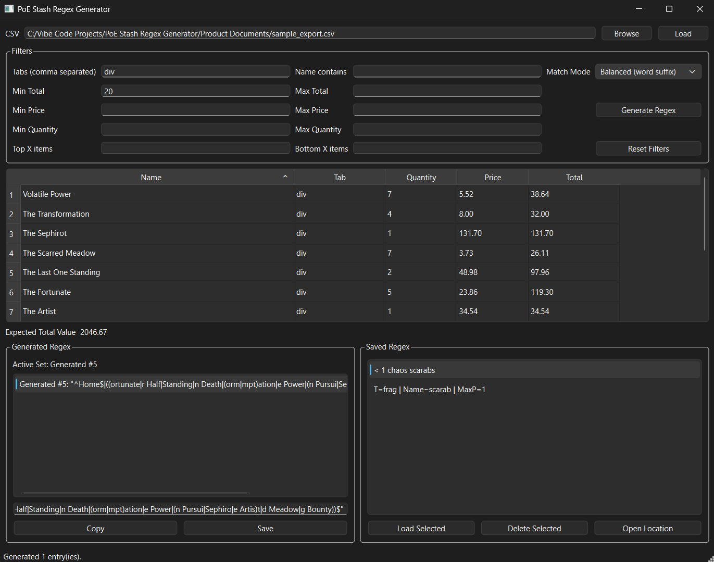

# PoE Stash Regex Generator

Desktop app that reads a local CSV export of Path of Exile stash data, filters items, and generates compact regex strings for in-game stash search. The core logic is headless and tested; the GUI is a thin shell over the core modules.

## Screenshot


## Demo
https://www.youtube.com/watch?v=tmT83r8fARQ

## Features
- Load CSV exports (up to 10,000 rows)
- Filter by tab, name substring, total/price/quantity thresholds, top/bottom X
- Sort by name/tab/quantity/total
- Generate regex entries with selectable match modes (Balanced/Exact/Compact)
- Copy regex entries (quoted for in-game search)
- Save and load regex entries locally

## Project Layout
- `src/` application code
- `tests/` automated tests
- `Product Documents/` PRD and design documents (non-code)

## Requirements
- Python 3.12+ (tested with 3.14)
- Windows

## Setup
```powershell
python -m venv .venv
.\.venv\Scripts\python -m pip install -r requirements.txt
```

## Run the GUI
```powershell
.\.venv\Scripts\python src\app.py
```

## Run the CLI
```powershell
.\.venv\Scripts\python src\cli.py --csv "Product Documents\sample_export.csv" --tabs frag --min-total 100 --sort-field total --sort-desc
```

Match modes:
- `balanced` (default): longer suffixes, avoids tiny matches
- `exact`: full-name anchors only
- `compact`: shortest safe suffixes

## Tests
```powershell
.\.venv\Scripts\python -m pytest -q
```

## Saved Regex Location
Saved entries are stored in:
`%APPDATA%\PoE Stash Regex Generator\saved_regex.json`
